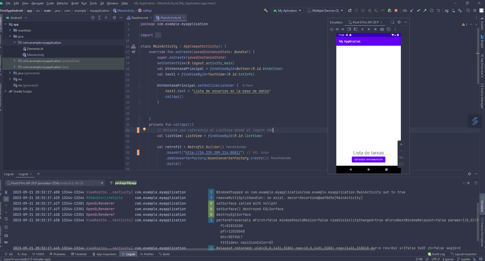
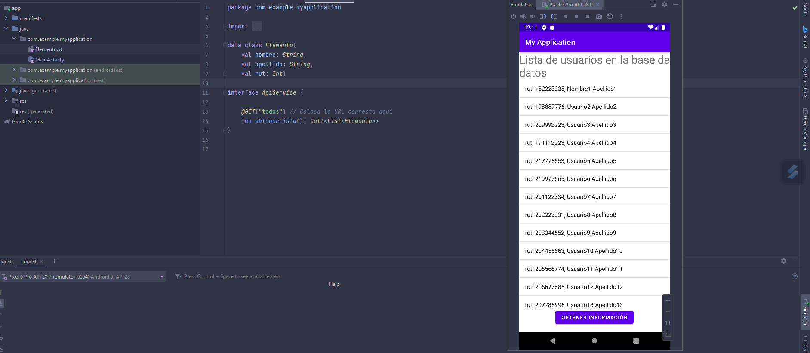
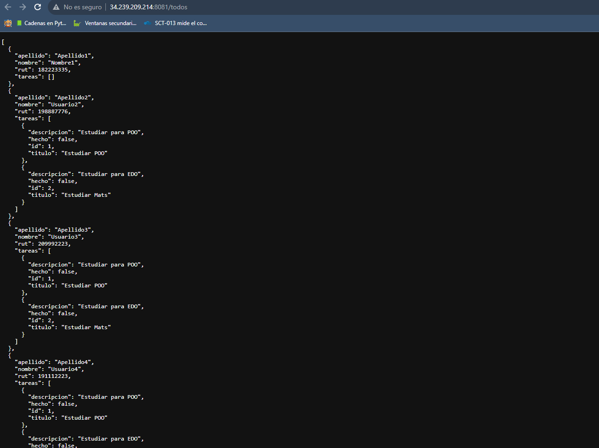

### App Android con conexión remota a una api creada con flask en el servidor de aws

Al presionar el botón en la app, conecta con la url http://34.239.209.214:8081/todos que devuelve una lista de usuarios registrados en la base de datos 

